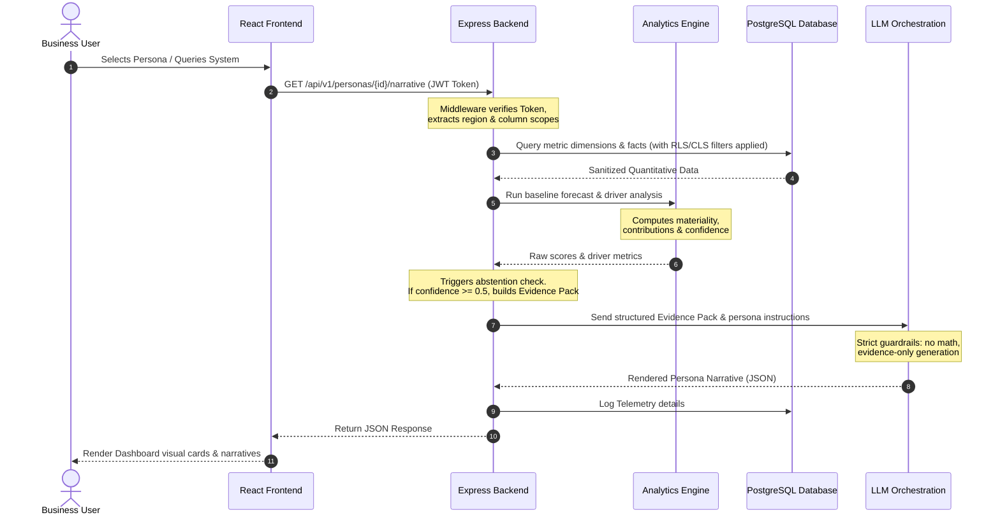

# KPI Intelligence-to-Action Engine — Documentation Index

Welcome to the official documentation directory for the **KPI Intelligence-to-Action Engine** (omnichannel e-commerce analytics platform). This documentation directory aligns exactly with the repository structure specified in the project knowledge base.

## Documentation Map

Below is the directory map of the documentation files:

| File | Path | Description |
|---|---|---|
| **Overview & Index** | [`README.md`](file:///c:/Users/ankit/Desktop/BusinessIntelligence_AI/docs/README.md) | This index file. |
| **System Architecture** | [`architecture.md`](file:///c:/Users/ankit/Desktop/BusinessIntelligence_AI/docs/architecture.md) | Non-LLM mathematical baseline, forecasting, and data reconciliation logic. |
| **Data Model** | [`data_model.md`](file:///c:/Users/ankit/Desktop/BusinessIntelligence_AI/docs/data_model.md) | Dimensions, facts, governance, insight, and learning schema structures. |
| **KPI Semantic Contracts** | [`kpi_contracts.md`](file:///c:/Users/ankit/Desktop/BusinessIntelligence_AI/docs/kpi_contracts.md) | Governed metric contracts YAML templates and rules. |
| **Personas** | [`personas.md`](file:///c:/Users/ankit/Desktop/BusinessIntelligence_AI/docs/personas.md) | CFO, Supply Chain Manager, Marketing Manager, and Analyst definitions. |
| **Security Model** | [`security_model.md`](file:///c:/Users/ankit/Desktop/BusinessIntelligence_AI/docs/security_model.md) | Row-Level Security, Column-Level Security, and domain constraints. |
| **LLM Guardrails** | [`llm_guardrails.md`](file:///c:/Users/ankit/Desktop/BusinessIntelligence_AI/docs/llm_guardrails.md) | Prompt rules, Evidence Pack schema, and context validation guidelines. |
| **Telemetry & Costs** | [`telemetry.md`](file:///c:/Users/ankit/Desktop/BusinessIntelligence_AI/docs/telemetry.md) | Request, insight, and LLM token cost formulas and telemetry models. |
| **Evaluation Framework** | [`evaluation.md`](file:///c:/Users/ankit/Desktop/BusinessIntelligence_AI/docs/evaluation.md) | Automated evaluation pipeline and the four Golden Incident scenarios. |
| **Deployment & Build Plan** | [`deployment.md`](file:///c:/Users/ankit/Desktop/BusinessIntelligence_AI/docs/deployment.md) | Environmental setup, hosting checklist, and the one-week build schedule. |
| **Demo Script** | [`demo_script.md`](file:///c:/Users/ankit/Desktop/BusinessIntelligence_AI/docs/demo_script.md) | Narrative walkthrough instructions for the web application verification. |

---

## Core System Requests Flow

