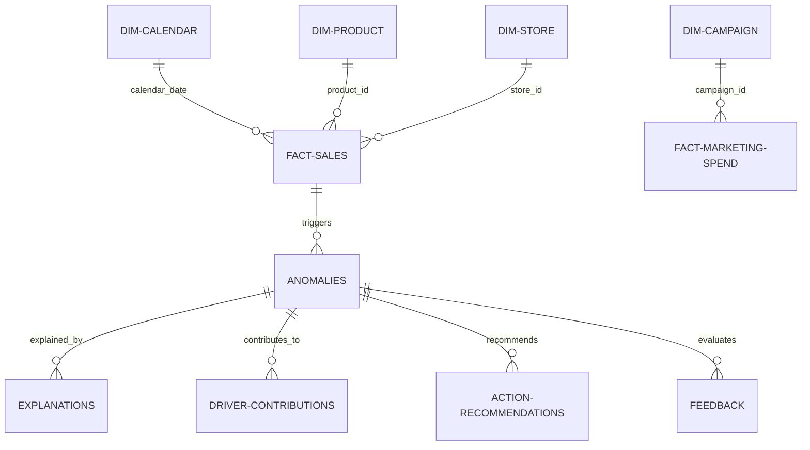

# Data Model Reference — KPI Intelligence Engine

This document details the relational database schema of the KPI Intelligence Engine hosted in PostgreSQL.

---

## 1. Schema Classification

The database tables are divided into five logical domains: Dimensions, Facts, Governance, Insights, and Learning.

---

## 2. Dimension Tables

### `dim_product`
Stores catalog metadata for SKU classification.
*   `product_id` (UUID, PK)
*   `sku` (VARCHAR, Unique)
*   `name` (VARCHAR)
*   `category` (VARCHAR)
*   `price` (NUMERIC)
*   `cost` (NUMERIC)

### `dim_store`
Stores physical and digital channels details.
*   `store_id` (UUID, PK)
*   `name` (VARCHAR)
*   `region` (VARCHAR) -- Used for Row-Level Security (e.g. EU, US)
*   `channel_type` (VARCHAR) -- 'online' or 'retail'

### `dim_campaign`
Stores marketing campaigns metadata.
*   `campaign_id` (UUID, PK)
*   `name` (VARCHAR)
*   `channel` (VARCHAR) -- 'paid_search', 'social', 'email'

### `dim_calendar`
Time dimension for holiday and financial calendars alignment.
*   `calendar_date` (DATE, PK)
*   `week_of_year` (INTEGER)
*   `month` (INTEGER)
*   `quarter` (INTEGER)
*   `is_holiday` (BOOLEAN)

---

## 3. Fact Tables

Fact tables represent raw transaction records at different grains and freshness latencies.

| Table Name | Description | Grain | Refresh Cadence |
|---|---|---|---|
| **`fact_sales`** | Transactional revenue & returns | product-store-day | Daily |
| **`fact_inventory`** | Inventory levels & stockout states | product-store-day | Daily |
| **`fact_marketing_spend`** | Digital advertisement metrics | campaign-day | Weekly (with lag) |
| **`fact_web_traffic`** | Session activity logs | channel-device-day | Hourly |
| **`fact_shipments`** | Logistical delivery statuses | order-line-day | Daily |

---

## 4. Governance Tables

### `kpi_definitions`
Holds metric metadata and semantic contracts rules.
*   `kpi_id` (VARCHAR, PK) -- e.g., 'net_revenue'
*   `name` (VARCHAR)
*   `owner` (VARCHAR)
*   `business_definition` (TEXT)
*   `formula` (TEXT)
*   `grain` (VARCHAR)
*   `refresh_cadence` (VARCHAR)
*   `version` (VARCHAR)

### `source_status`
Tracks freshness timestamps and quality indicators of data ingestion pipelines.
*   `source_name` (VARCHAR, PK) -- e.g., 'fact_web_traffic'
*   `last_successful_refresh` (TIMESTAMP WITH TIME ZONE)
*   `completeness_score` (NUMERIC)
*   `is_active` (BOOLEAN)

---

## 5. Insight & Analytical Output Tables

### `anomalies`
Stores detected statistical metric outliers.
*   `anomaly_id` (UUID, PK)
*   `kpi_id` (VARCHAR) -- FK to `kpi_definitions`
*   `period` (VARCHAR)
*   `actual_value` (NUMERIC)
*   `forecast_value` (NUMERIC)
*   `delta` (NUMERIC)
*   `z_score` (NUMERIC)
*   `materiality_score` (NUMERIC)
*   `data_quality_score` (NUMERIC)
*   `created_at` (TIMESTAMP WITH TIME ZONE)

### `driver_contributions`
Holds the deterministic attribution breakdown of each anomaly.
*   `contribution_id` (UUID, PK)
*   `anomaly_id` (UUID) -- FK to `anomalies`
*   `driver_id` (VARCHAR)
*   `estimated_impact` (NUMERIC)
*   `confidence_score` (NUMERIC)

### `explanations`
Stores generated narratives linked to specific personas.
*   `explanation_id` (UUID, PK)
*   `anomaly_id` (UUID) -- FK to `anomalies`
*   `persona_id` (VARCHAR) -- 'cfo', 'marketing_manager', etc.
*   `narrative_text` (TEXT)
*   `evidence_citations` (JSONB)
*   `created_at` (TIMESTAMP WITH TIME ZONE)

### `action_recommendations`
Stores recommended responses mapped to identified drivers.
*   `action_id` (UUID, PK)
*   `anomaly_id` (UUID) -- FK to `anomalies`
*   `action_name` (VARCHAR)
*   `owner_persona` (VARCHAR)
*   `expected_impact` (NUMERIC)
*   `monitoring_plan` (TEXT)
*   `status` (VARCHAR) -- 'pending', 'accepted', 'rejected'

---

## 6. Learning & Feedback Tables

### `feedback`
Captures user modifications and ratings of generated suggestions.
*   `feedback_id` (UUID, PK)
*   `insight_id` (UUID) -- FK to explanations/anomalies
*   `user_id` (VARCHAR)
*   `persona` (VARCHAR)
*   `helpful` (BOOLEAN)
*   `root_cause_correct` (VARCHAR) -- 'yes', 'no', 'partial'
*   `accepted_action` (BOOLEAN)
*   `corrected_driver` (VARCHAR)
*   `comments` (TEXT)
*   `timestamp` (TIMESTAMP WITH TIME ZONE)

### `telemetry_requests`
Tracks API logs.
*   `request_id` (VARCHAR, PK)
*   `user_id` (VARCHAR)
*   `persona` (VARCHAR)
*   `method` (VARCHAR)
*   `path` (VARCHAR)
*   `status_code` (INTEGER)
*   `latency_ms` (INTEGER)

### `telemetry_llm_calls`
Monitors prompt metrics and provider costs.
*   `llm_call_id` (UUID, PK)
*   `request_id` (VARCHAR)
*   `model_name` (VARCHAR)
*   `provider` (VARCHAR)
*   `input_tokens` (INTEGER)
*   `output_tokens` (INTEGER)
*   `latency_ms` (INTEGER)
*   `estimated_cost_usd` (NUMERIC)
*   `validation_passed` (BOOLEAN)
