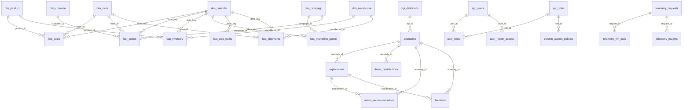

# Database Architecture & Entity Relationship Diagram (ERD)

This document details the complete revised relational database schema for the KPI Intelligence-to-Action Engine. It incorporates all 7 structural recommendations to resolve the gaps in **CAC**, **Online Conversion Rate**, **OTIF**, **Warehouse Dimensions**, **Persona Explanations**, **Security**, and **Telemetry**.

---

## 1. Unified Entity-Relationship Diagram (Mermaid)

The following diagram maps the comprehensive data model schema including all primary/foreign key connections and cardinality relations.

---

## 2. Table Schemas & Alignment with KPIs

### 2.1 Dimensions Layer

#### `dim_calendar`
*   `date_key` (DATE, PK)
*   `week_of_year` (INTEGER)
*   `month_val` (INTEGER)
*   `quarter` (INTEGER)
*   `year_val` (INTEGER)
*   `is_weekend` (BOOLEAN)
*   `is_holiday` (BOOLEAN)
*   `holiday_name` (VARCHAR)

#### `dim_product`
*   `product_id` (VARCHAR, PK)
*   `sku` (VARCHAR, Unique)
*   `product_name` (VARCHAR)
*   `category` (VARCHAR)
*   `price` (NUMERIC)
*   `cost` (NUMERIC)

#### `dim_store`
*   `store_id` (VARCHAR, PK)
*   `store_name` (VARCHAR)
*   `region` (VARCHAR) -- Partition filter for RLS
*   `channel_type` (VARCHAR) -- 'Online' or 'Retail'
*   `warehouse_id` (VARCHAR, FK to `dim_warehouse`)

#### `dim_campaign`
*   `campaign_id` (VARCHAR, PK)
*   `campaign_name` (VARCHAR)
*   `marketing_channel` (VARCHAR) -- 'Paid Search', 'Social', 'Email'
*   `region` (VARCHAR)

#### `dim_customer` (NEW - Resolves CAC Gap)
*   `customer_id` (VARCHAR, PK)
*   `first_order_date` (DATE)
*   `acquisition_channel` (VARCHAR)
*   `acquisition_campaign_id` (VARCHAR, FK to `dim_campaign`)
*   `region` (VARCHAR)
*   `is_active` (BOOLEAN)

#### `dim_warehouse` (NEW - Resolves Supply Chain Gap)
*   `warehouse_id` (VARCHAR, PK)
*   `warehouse_name` (VARCHAR)
*   `region` (VARCHAR)
*   `capacity_units` (INTEGER)
*   `average_processing_time_hours` (INTEGER)

---

### 2.2 Facts Layer

#### `fact_sales` (Granularity: `product x store x day`)
*   `sales_id` (SERIAL, PK)
*   `date_key` (DATE, FK to `dim_calendar`)
*   `product_id` (VARCHAR, FK to `dim_product`)
*   `store_id` (VARCHAR, FK to `dim_store`)
*   `gross_revenue` (NUMERIC)
*   `discount_amount` (NUMERIC)
*   `returns_amount` (NUMERIC) -- Added: Resolves return cost mapping
*   `cogs` (NUMERIC)
*   `gross_margin` (NUMERIC)
*   `units_sold` (INTEGER)

#### `fact_orders` (NEW - Resolves Online Conversion & CAC Gaps)
*   `order_id` (VARCHAR, PK)
*   `date_key` (DATE, FK to `dim_calendar`)
*   `store_id` (VARCHAR, FK to `dim_store`)
*   `customer_id` (VARCHAR, FK to `dim_customer`)
*   `campaign_id` (VARCHAR, FK to `dim_campaign`, Nullable)
*   `order_status` (VARCHAR) -- 'Completed', 'Returned', 'Cancelled'
*   `net_revenue` (NUMERIC)
*   `cogs` (NUMERIC)
*   `gross_margin` (NUMERIC)
*   `is_new_customer` (BOOLEAN) -- Crucial for true CAC calculation

#### `fact_inventory` (Granularity: `product x warehouse x day`)
*   `inventory_id` (SERIAL, PK)
*   `date_key` (DATE, FK to `dim_calendar`)
*   `product_id` (VARCHAR, FK to `dim_product`)
*   `warehouse_id` (VARCHAR, FK to `dim_warehouse`) -- Linked to dim_warehouse PK
*   `units_on_hand` (INTEGER)
*   `units_reserved` (INTEGER)
*   `units_available` (INTEGER GENERATED)
*   `stockout_flag` (BOOLEAN)
*   `lost_sales_estimated_units` (INTEGER)

#### `fact_marketing_spend` (Granularity: `campaign x day`)
*   `marketing_id` (SERIAL, PK)
*   `date_key` (DATE, FK to `dim_calendar`)
*   `campaign_id` (VARCHAR, FK to `dim_campaign`)
*   `spend_amount` (NUMERIC)
*   `clicks` (INTEGER)
*   `impressions` (INTEGER)

#### `fact_web_traffic` (Granularity: `store x day`)
*   `traffic_id` (SERIAL, PK)
*   `date_key` (DATE, FK to `dim_calendar`)
*   `store_id` (VARCHAR, FK to `dim_store`)
*   `sessions` (INTEGER)
*   `page_views` (INTEGER)
*   `bounce_rate` (NUMERIC)
*   `cart_additions` (INTEGER)
*   `checkout_initiations` (INTEGER)

#### `fact_shipments` (Granularity: `order x carrier x day`)
*   `shipment_id` (SERIAL, PK)
*   `order_id` (VARCHAR) -- FK to `fact_orders.order_id` if using orders
*   `date_key` (DATE, FK to `dim_calendar`)
*   `store_id` (VARCHAR, FK to `dim_store`) -- Drill-down dimension
*   `warehouse_id` (VARCHAR, FK to `dim_warehouse`) -- Drill-down dimension
*   `carrier_name` (VARCHAR)
*   `promised_delivery_date` (DATE)
*   `actual_delivery_date` (DATE, Nullable)
*   `on_time_flag` (BOOLEAN) -- Detailed drill-down flag
*   `in_full_flag` (BOOLEAN) -- Detailed drill-down flag
*   `is_otif` (BOOLEAN) -- Unified target KPI flag

---

### 2.3 Governance & Analytical Insights Layer

#### `kpi_definitions`
*   `kpi_id` (VARCHAR, PK)
*   `name` (VARCHAR)
*   `owner` (VARCHAR)
*   `business_definition` (TEXT)
*   `formula` (TEXT)
*   `grain` (VARCHAR)
*   `unit` (VARCHAR) -- e.g. 'currency_usd', 'percentage'
*   `direction` (VARCHAR) -- 'Increase is good' / 'Decrease is good'
*   `refresh_cadence` (VARCHAR)
*   `threshold_percent` (NUMERIC)
*   `threshold_absolute` (NUMERIC)
*   `primary_source_table` (VARCHAR)

#### `source_status`
*   `source_name` (VARCHAR, PK)
*   `last_successful_refresh` (TIMESTAMP)
*   `completeness_score` (NUMERIC)
*   `expected_refresh_cadence` (VARCHAR)
*   `sla_hours` (INTEGER)
*   `is_active` (BOOLEAN)

#### `anomalies`
*   `anomaly_id` (VARCHAR, PK)
*   `date_key` (DATE, FK to `dim_calendar`)
*   `kpi_id` (VARCHAR, FK to `kpi_definitions`)
*   `observed_value` (NUMERIC)
*   `expected_value` (NUMERIC)
*   `deviation_percentage` (NUMERIC)
*   `z_score` (NUMERIC)
*   `materiality_score` (NUMERIC)
*   `data_quality_score` (NUMERIC)
*   `detection_method` (VARCHAR)
*   `dimension_scope` (JSONB) -- Multi-dimensional anomalies filter scope
*   `period_grain` (VARCHAR) -- 'daily', 'weekly'
*   `created_at` (TIMESTAMP)

#### `explanations` (Persona-Specific Narrative Resolution)
*   `explanation_id` (VARCHAR, PK)
*   `anomaly_id` (VARCHAR, FK to `anomalies`)
*   `persona_id` (VARCHAR) -- CFO, Marketing Manager, Supply Chain Manager
*   `narrative_text` (TEXT)
*   `evidence_citations` (JSONB)
*   `overall_confidence_score` (NUMERIC)
*   `overall_confidence_tier` (VARCHAR) -- 'High', 'Medium', 'Low', 'Abstained'
*   `evidence_pack` (JSONB) -- Captures exact audit pack fed to the LLM
*   `llm_model` (VARCHAR)
*   `prompt_version` (VARCHAR)
*   `input_tokens` (INTEGER)
*   `output_tokens` (INTEGER)
*   `estimated_cost_usd` (NUMERIC)

#### `driver_contributions`
*   `driver_id` (SERIAL, PK)
*   `anomaly_id` (VARCHAR, FK to `anomalies`)
*   `driver_name` (VARCHAR)
*   `contribution_value` (NUMERIC)
*   `contribution_percentage` (NUMERIC)
*   `driver_rank` (INTEGER)
*   `method` (VARCHAR)
*   `confidence_score` (NUMERIC)
*   `evidence_payload` (JSONB)

#### `action_recommendations`
*   `recommendation_id` (SERIAL, PK)
*   `anomaly_id` (VARCHAR, FK to `anomalies`)
*   `recommended_action` (TEXT)
*   `owner_persona` (VARCHAR)
*   `action_type` (VARCHAR)
*   `expected_impact_value` (NUMERIC)
*   `confidence_score` (NUMERIC)
*   `action_status` (VARCHAR) -- 'Proposed', 'Accepted', 'Rejected'
*   `monitoring_metric` (VARCHAR)
*   `monitoring_plan` (TEXT)

---

### 2.4 Security & Telemetry Layer (NEW)

#### `app_users`
*   `user_id` (VARCHAR, PK)
*   `email` (VARCHAR, Unique)
*   `full_name` (VARCHAR)
*   `persona` (VARCHAR)
*   `is_active` (BOOLEAN)

#### `app_roles`
*   `role_id` (VARCHAR, PK)
*   `role_name` (VARCHAR)

#### `user_roles`
*   `user_id` (VARCHAR, FK to `app_users`)
*   `role_id` (VARCHAR, FK to `app_roles`)
*   PRIMARY KEY (`user_id`, `role_id`)

#### `user_region_access` (RLS filter boundaries)
*   `user_id` (VARCHAR, FK to `app_users`)
*   `region` (VARCHAR)
*   PRIMARY KEY (`user_id`, `region`)

#### `column_access_policies` (CLS enforcement rules)
*   `policy_id` (SERIAL, PK)
*   `role_id` (VARCHAR, FK to `app_roles`)
*   `table_name` (VARCHAR)
*   `column_name` (VARCHAR)
*   `access_level` (VARCHAR) -- 'Allow', 'Mask', 'Deny'

#### `telemetry_requests` (HTTP Audit logging)
*   `request_id` (VARCHAR, PK)
*   `user_id` (VARCHAR, FK to `app_users`, Nullable)
*   `persona` (VARCHAR, Nullable)
*   `endpoint` (VARCHAR)
*   `status_code` (INTEGER)
*   `latency_ms` (INTEGER)
*   `created_at` (TIMESTAMP)

#### `telemetry_llm_calls` (Token / Cost audit trails)
*   `llm_call_id` (VARCHAR, PK)
*   `request_id` (VARCHAR, FK to `telemetry_requests`)
*   `llm_provider` (VARCHAR)
*   `model_name` (VARCHAR)
*   `input_tokens` (INTEGER)
*   `output_tokens` (INTEGER)
*   `latency_ms` (INTEGER)
*   `estimated_cost_usd` (NUMERIC)
*   `cache_hit` (BOOLEAN)
*   `validation_passed` (BOOLEAN)

#### `telemetry_insights` (Analytics tracing)
*   `insight_telemetry_id` (SERIAL, PK)
*   `request_id` (VARCHAR, FK to `telemetry_requests`)
*   `anomaly_id` (VARCHAR, FK to `anomalies`)
*   `detection_latency_ms` (INTEGER)
*   `materiality_score` (NUMERIC)
*   `confidence_score` (NUMERIC)
*   `data_quality_score` (NUMERIC)

# Database Schema Metadata & Column Definitions

This reference details the purpose and business logic of every single column within the database schema of the KPI Intelligence-to-Action Engine.

---

## 1. Dimension Tables

### `dim_calendar`
*   `date_key` (DATE, PK): The absolute calendar date. Used as the join key for all operational time dimensions.
*   `week_of_year` (INTEGER): ISO week number (1-53) to group weekly baseline comparisons.
*   `month_val` (INTEGER): Calendar month (1-12) used to apply monthly seasonal adjustments.
*   `quarter` (INTEGER): Calendar quarter (1-4) for financial tracking.
*   `year_val` (INTEGER): Calendar year.
*   `is_weekend` (BOOLEAN): Flag indicating if the date falls on Saturday or Sunday.
*   `is_holiday` (BOOLEAN): Flag indicating if the date is a commercial holiday (e.g. Black Friday).
*   `holiday_name` (VARCHAR): Name of the holiday (null if not a holiday).

### `dim_product`
*   `product_id` (VARCHAR, PK): Unique identification code for each product.
*   `sku` (VARCHAR, Unique): Stock Keeping Unit string used for inventory tracking.
*   `product_name` (VARCHAR): Retail catalog name.
*   `category` (VARCHAR): High-level category classification (e.g., Electronics).
*   `price` (NUMERIC): Selling price of the item.
*   `cost` (NUMERIC): Cost of Goods Sold (COGS) value per unit.

### `dim_store`
*   `store_id` (VARCHAR, PK): Unique ID for each sales point.
*   `store_name` (VARCHAR): Name of the location.
*   `region` (VARCHAR): Geography marker (e.g., EU, US) used to enforce Row-Level Security.
*   `channel_type` (VARCHAR): Operational channel (e.g., 'Online', 'Retail').
*   `warehouse_id` (VARCHAR, FK): The warehouse serving this specific store location.

### `dim_campaign`
*   `campaign_id` (VARCHAR, PK): ID of the marketing campaign.
*   `campaign_name` (VARCHAR): Human-readable name.
*   `marketing_channel` (VARCHAR): Medium used (e.g. Paid Search, Email).
*   `region` (VARCHAR): Target region.

### `dim_customer`
*   `customer_id` (VARCHAR, PK): Unique customer identifier.
*   `first_order_date` (DATE): Date of first purchase (essential to calculate cohort age and new user acquisition flags).
*   `acquisition_channel` (VARCHAR): Ad channel that brought in the user.
*   `acquisition_campaign_id` (VARCHAR, FK): Campaign responsible for the acquisition.
*   `region` (VARCHAR): Customer home region.
*   `is_active` (BOOLEAN): Active status indicator.

### `dim_warehouse`
*   `warehouse_id` (VARCHAR, PK): Regional fulfillment center ID.
*   `warehouse_name` (VARCHAR): Physical warehouse name.
*   `region` (VARCHAR): Location region.
*   `capacity_units` (INTEGER): Maximum storage capabilities.
*   `average_processing_time_hours` (INTEGER): Average time between order placement and handoff to the shipping carrier.

---

## 2. Fact Tables

### `fact_sales`
*   `sales_id` (SERIAL, PK): Row sequence identifier.
*   `date_key` (DATE, FK): Transaction date.
*   `product_id` (VARCHAR, FK): Product sold.
*   `store_id` (VARCHAR, FK): Store sold from.
*   `gross_revenue` (NUMERIC): Total revenue calculation: `units_sold * base_price`.
*   `discount_amount` (NUMERIC): Total discounts applied to this sale.
*   `returns_amount` (NUMERIC): Cash refund value matching returned units.
*   `cogs` (NUMERIC): Total cost of units sold: `units_sold * unit_cost`.
*   `gross_margin` (NUMERIC): Total profit: `gross_revenue - discount_amount - returns_amount - cogs`.
*   `units_sold` (INTEGER): Total quantity sold.

### `fact_orders`
*   `order_id` (VARCHAR, PK): Transaction order ID.
*   `date_key` (DATE, FK): Order purchase date.
*   `store_id` (VARCHAR, FK): Store location.
*   `customer_id` (VARCHAR, FK): Customer account.
*   `campaign_id` (VARCHAR, FK): Marketing campaign attribution.
*   `order_status` (VARCHAR): Transaction status (e.g., Completed, Cancelled).
*   `net_revenue` (NUMERIC): Order revenue after discounts and returns.
*   `cogs` (NUMERIC): Order cost of goods sold.
*   `gross_margin` (NUMERIC): Margin on order.
*   `is_new_customer` (BOOLEAN): Set to true if it is the customer's first purchase. (Determines CAC denominator).

### `fact_inventory`
*   `inventory_id` (SERIAL, PK): Snapshot row sequence.
*   `date_key` (DATE, FK): Inventory snapshot date.
*   `product_id` (VARCHAR, FK): Product item.
*   `warehouse_id` (VARCHAR, FK): Fulfillment center.
*   `units_on_hand` (INTEGER): Physical stock count in the warehouse.
*   `units_reserved` (INTEGER): Stock sold but not yet shipped.
*   `units_available` (INTEGER GENERATED): Available inventory for sale: `units_on_hand - units_reserved`.
*   `stockout_flag` (BOOLEAN): True if `units_available <= 0`.
*   `lost_sales_estimated_units` (INTEGER): Modeled units of demand lost because of stockout.

### `fact_marketing_spend`
*   `marketing_id` (SERIAL, PK): Budget entry ID.
*   `date_key` (DATE, FK): Ad spending date.
*   `campaign_id` (VARCHAR, FK): Target campaign.
*   `spend_amount` (NUMERIC): Total budget spent.
*   `clicks` (INTEGER): Total ad clicks.
*   `impressions` (INTEGER): Total ad views.

### `fact_web_traffic`
*   `traffic_id` (SERIAL, PK): Traffic log ID.
*   `date_key` (DATE, FK): Web log date.
*   `store_id` (VARCHAR, FK): E-commerce storefront.
*   `sessions` (INTEGER): Total user visits.
*   `page_views` (INTEGER): Total pages loaded.
*   `bounce_rate` (NUMERIC): Percent of single-page visits.
*   `cart_additions` (INTEGER): Count of items added to checkout carts.
*   `checkout_initiations` (INTEGER): Count of users initiating the checkout funnel.

### `fact_shipments`
*   `shipment_id` (SERIAL, PK): Shipping record ID.
*   `order_id` (VARCHAR): Transaction order identifier.
*   `date_key` (DATE, FK): Handoff shipment date.
*   `store_id` (VARCHAR, FK): Store source.
*   `warehouse_id` (VARCHAR, FK): Dispatching center.
*   `carrier_name` (VARCHAR): Delivery service (e.g. FedEx).
*   `promised_delivery_date` (DATE): Promised delivery deadline.
*   `actual_delivery_date` (DATE): Actual arrival date.
*   `on_time_flag` (BOOLEAN): True if delivery met promised deadline.
*   `in_full_flag` (BOOLEAN): True if all items arrived in one package.
*   `is_otif` (BOOLEAN): True if both on-time and in-full requirements are met.

---

## 3. Governance & Analytical Insights

### `kpi_definitions`
*   `kpi_id` (VARCHAR, PK): System identifier for the metric.
*   `name` (VARCHAR): Display name.
*   `owner` (VARCHAR): Department contact.
*   `business_definition` (TEXT): Description of the metric.
*   `formula` (TEXT): The exact mathematical SQL formula.
*   `grain` (VARCHAR): The metric aggregation grain.
*   `unit` (VARCHAR): Measurement unit (e.g. currency).
*   `direction` (VARCHAR): Desired KPI delta path.
*   `refresh_cadence` (VARCHAR): Ingestion target schedule.
*   `threshold_percent` (NUMERIC): Percent variance anomaly trigger limit.
*   `threshold_absolute` (NUMERIC): Absolute dollar anomaly trigger limit.
*   `primary_source_table` (VARCHAR): Core baseline source table.

### `source_status`
*   `source_name` (VARCHAR, PK): Target source database table.
*   `last_successful_refresh` (TIMESTAMP): Date/time of the last pipeline execution.
*   `completeness_score` (NUMERIC): Measure of missing rows in the source feed (0 to 1).
*   `expected_refresh_cadence` (VARCHAR): Expected updates cadence (e.g., hourly).
*   `sla_hours` (INTEGER): Allowed ingestion delay threshold.
*   `is_active` (BOOLEAN): Active database feed indicator.

### `anomalies`
*   `anomaly_id` (VARCHAR, PK): Detected outlier ID.
*   `date_key` (DATE, FK): Target anomaly date.
*   `kpi_id` (VARCHAR, FK): Metric type.
*   `observed_value` (NUMERIC): Actual measured value.
*   `expected_value` (NUMERIC): Calculated baseline forecast value.
*   `deviation_percentage` (NUMERIC): Percent delta versus baseline.
*   `z_score` (NUMERIC): Standard deviations away from baseline.
*   `materiality_score` (NUMERIC): Dollar-scaled impact score.
*   `data_quality_score` (NUMERIC): Input quality score derived from source metadata.
*   `detection_method` (VARCHAR): Name of statistical rule used (e.g., Z-Score).
*   `dimension_scope` (JSONB): Filters matching this outlier (e.g. `{"region": "EU"}`).
*   `period_grain` (VARCHAR): Timeline granularity (daily, weekly).
*   `created_at` (TIMESTAMP): Record creation date.

### `explanations`
*   `explanation_id` (VARCHAR, PK): Narrative record ID.
*   `anomaly_id` (VARCHAR, FK): Anomaly source.
*   `persona_id` (VARCHAR): Target viewer (e.g., CFO).
*   `narrative_text` (TEXT): The generated causal description text.
*   `evidence_citations` (JSONB): Specific sources and metrics cited as facts.
*   `overall_confidence_score` (NUMERIC): Confidence rating of explanation.
*   `overall_confidence_tier` (VARCHAR): Rating categorization (High, Low, Abstained).
*   `evidence_pack` (JSONB): Complete input audit payload sent to LLM.
*   `llm_model` (VARCHAR): Model used (e.g., Gemini).
*   `prompt_version` (VARCHAR): Version tag for prompt template.
*   `input_tokens` (INTEGER): Prompt input tokens count.
*   `output_tokens` (INTEGER): Prompt output tokens count.
*   `estimated_cost_usd` (NUMERIC): Incurred LLM cost.

### `driver_contributions`
*   `driver_id` (SERIAL, PK): Driver record ID.
*   `anomaly_id` (VARCHAR, FK): Anomaly target.
*   `driver_name` (VARCHAR): Name of driver (e.g., stockout).
*   `contribution_value` (NUMERIC): Calculated absolute impact.
*   `contribution_percentage` (NUMERIC): Percentage impact.
*   `driver_rank` (INTEGER): Impact ranking (1, 2, 3...).
*   `method` (VARCHAR): Statistical model used.
*   `confidence_score` (NUMERIC): Engine's confidence in this driver.
*   `evidence_payload` (JSONB): Supporting records for this driver.

### `action_recommendations`
*   `recommendation_id` (SERIAL, PK): Recommendation ID.
*   `anomaly_id` (VARCHAR, FK): Anomaly target.
*   `recommended_action` (TEXT): Business proposal text.
*   `owner_persona` (VARCHAR): Action owner.
*   `action_type` (VARCHAR): Action lever category.
*   `expected_impact_value` (NUMERIC): Predicted recovery dollar amount.
*   `confidence_score` (NUMERIC): Probability of action success.
*   `action_status` (VARCHAR): Status of proposal (e.g. Proposed, Accepted).
*   `monitoring_metric` (VARCHAR): Indicator to watch.
*   `monitoring_plan` (TEXT): Timeline and metric target rules.

---

## 4. Security & Telemetry

### `app_users`
*   `user_id` (VARCHAR, PK): Application User ID.
*   `email` (VARCHAR, Unique): Login email.
*   `full_name` (VARCHAR): User's name.
*   `persona` (VARCHAR): Assigned business persona.
*   `is_active` (BOOLEAN): Status flag.

### `app_roles`
*   `role_id` (VARCHAR, PK): Access role ID.
*   `role_name` (VARCHAR): Role classification name.

### `user_roles`
*   `user_id` (VARCHAR, FK): User.
*   `role_id` (VARCHAR, FK): Role.

### `user_region_access`
*   `user_id` (VARCHAR, FK): User.
*   `region` (VARCHAR): Region user is authorized to query.

### `column_access_policies`
*   `policy_id` (SERIAL, PK): Rule sequence ID.
*   `role_id` (VARCHAR, FK): Role target.
*   `table_name` (VARCHAR): Database table.
*   `column_name` (VARCHAR): Columns target.
*   `access_level` (VARCHAR): Mask/Block/Allow policy rules.

### `telemetry_requests`
*   `request_id` (VARCHAR, PK): HTTP request ID.
*   `user_id` (VARCHAR, FK): Request source user.
*   `persona` (VARCHAR): Persona header.
*   `endpoint` (VARCHAR): API path requested.
*   `status_code` (INTEGER): HTTP status response.
*   `latency_ms` (INTEGER): Execution time in milliseconds.
*   `created_at` (TIMESTAMP): Request date.

### `telemetry_llm_calls`
*   `llm_call_id` (VARCHAR, PK): Call ID.
*   `request_id` (VARCHAR, FK): Calling request.
*   `llm_provider` (VARCHAR): API client (e.g. Google).
*   `model_name` (VARCHAR): AI model version.
*   `input_tokens` (INTEGER): Input context tokens.
*   `output_tokens` (INTEGER): Generated response tokens.
*   `latency_ms` (INTEGER): Roundtrip API latency.
*   `estimated_cost_usd` (NUMERIC): Dollar price of the call.
*   `cache_hit` (BOOLEAN): True if response was loaded from cache.
*   `validation_passed` (BOOLEAN): True if JSON response met schema guardrails.
*   `error_message` (TEXT): Call trace errors.

### `telemetry_insights`
*   `insight_telemetry_id` (SERIAL, PK): Diagnostic tracing ID.
*   `request_id` (VARCHAR, FK): Request source.
*   `anomaly_id` (VARCHAR, FK): Anomaly referenced.
*   `detection_latency_ms` (INTEGER): Time taken to calculate baseline/outliers.
*   `materiality_score` (NUMERIC): Materiality.
*   `confidence_score` (NUMERIC): Confidence.
*   `data_quality_score` (NUMERIC): DQ.

