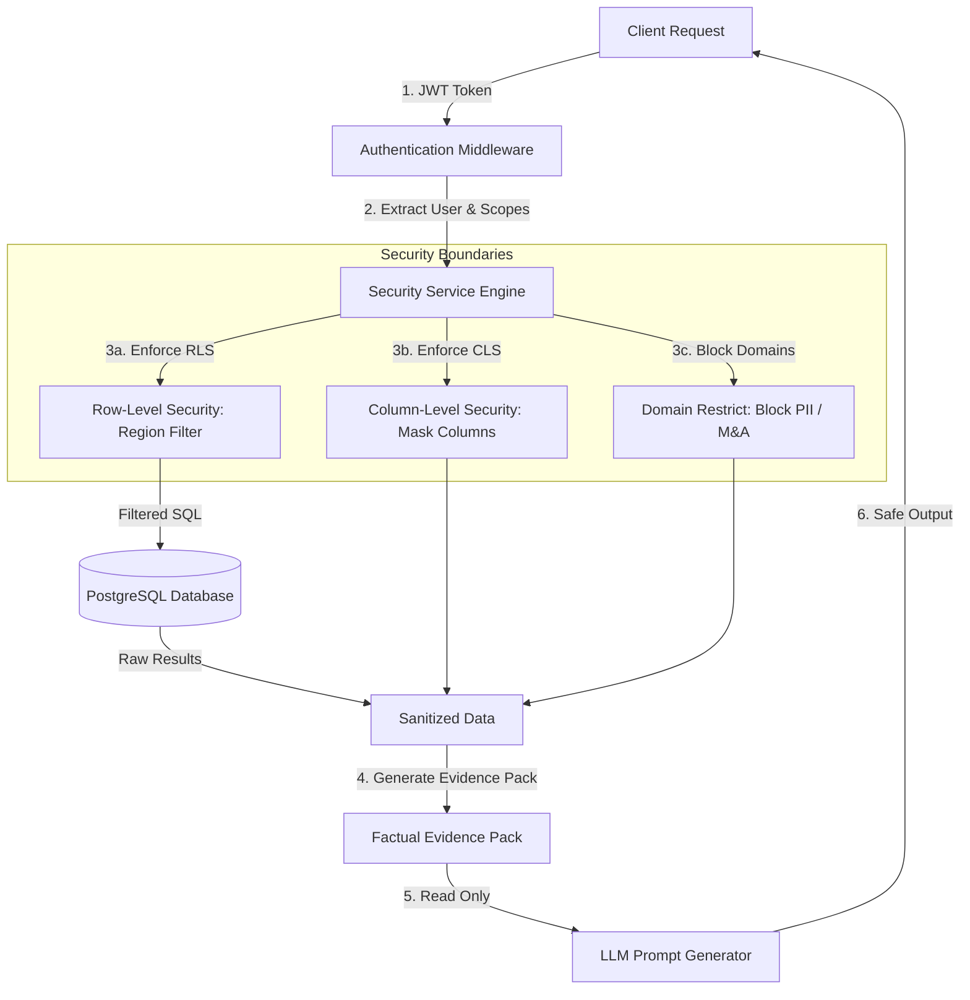

# Security Model & Access Governance — KPI Intelligence Engine

This document details the authentication, authorization, data masking, domain restriction, and logging models designed to protect the system's analytical layer and LLM pathways.

---

## 1. Governance Architecture

Security in the KPI Intelligence Engine is applied **before** data reaches the LLM orchestration layer. The LLM does not have direct access to database records, and all data queries pass through a deterministic security boundary in the backend.



---

## 2. Row-Level Security (RLS)
Row-Level Security controls which records a user can view based on their geographic scopes.
*   **Implementation**: Database query classes filter records based on the validated user region.
    ```sql
    SELECT * FROM fact_sales 
    WHERE region IN (:user_allowed_regions);
    ```
*   **Reconciliation Rules**: A user's effective region scope is the intersection of their role-level boundaries and user-level constraints:
    $$\text{Effective Scope} = \text{Role Scopes} \cap \text{User Scopes}$$

---

## 3. Column-Level Security (CLS)
Column-Level Security hides specific tables and columns (like margin, COGS, or raw cost values) from unauthorized roles:
*   **Implementation**: Centralized policy definitions map exact column exclusions (e.g. `fact_sales.cogs` or `dim_product.cost`).
*   **Application to LLM**: Masked columns are stripped out *prior* to generating the Evidence Pack JSON. This prevents data leaks via prompt text.

---

## 4. central Role Policies Definition (`role_policies.yaml`)

Governance policies are enforced backend-wide using the central `role_policies.yaml` contract. The model applies data classifications (PII, legal, mergers) to users:

```yaml
version: 1.2.0
default_policy: deny
audit_all_access: true

role_policies:
  cfo:
    row_level_security:
      region_scope: ALL
    column_access:
      allow:
        - fact_sales.net_revenue
        - fact_sales.gross_margin
        - fact_sales.cogs
  supply_chain_manager:
    row_level_security:
      region_scope: [EU, US]
    column_access:
      deny:
        - fact_sales.gross_margin
        - fact_sales.cogs
        - dim_product.cost
```
For the full schema, see [`role_policies.yaml`](file:///c:/Users/ankit/Desktop/BusinessIntelligence_AI/semantic/security/role_policies.yaml).
