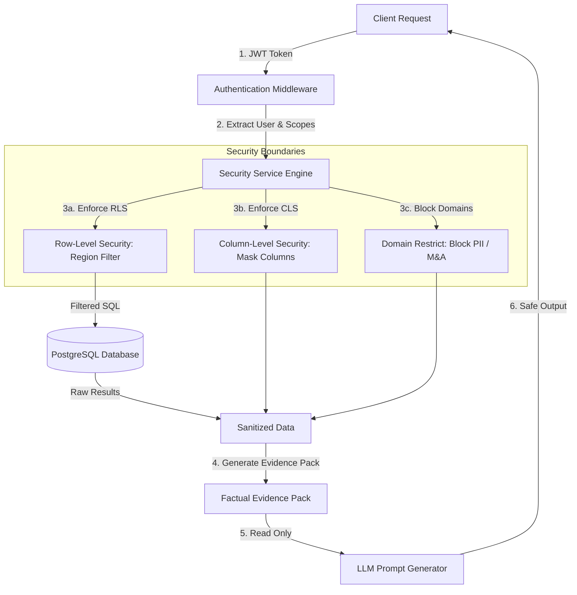

# Security Model & Access Governance — KPI Intelligence Engine

This document details the authentication, authorization, data masking, domain restriction, and logging models designed to protect the system's analytical layer and LLM pathways.

---

## 1. Governance Architecture

Security in the KPI Intelligence Engine is applied **before** data reaches the LLM orchestration layer. The LLM does not have direct access to database records, and all data queries pass through a deterministic security boundary in the backend.



---

## 2. Authentication & Session Control

*   **Prototype Framework**: Authentication uses demo user profiles mapped to distinct operational roles. Upon login, the system generates a standard **JWT Token** containing the user's ID, username, persona, and authorized geographical region.
*   **Production Setup**: The system is designed to delegate authentication to an enterprise Identity Provider (IdP) via OAuth 2.0 and OpenID Connect (OIDC) (e.g., Okta, Auth0, Entra ID) using JSON Web Keys (JWKS) validation and mandatory Multi-Factor Authentication (MFA).

---

## 3. Authorization & Access Governance

We implement a combination of Role-Based Access Control (RBAC) and Attribute-Based Access Control (ABAC) to restrict data access.

### 3.1 Row-Level Security (RLS)
Row-Level Security controls which records a user can view based on their attributes (such as geography or department).
*   **Implementation**: Database repository classes automatically inject region restrictions into SQL query clauses using values parsed from the validated JWT token:
    ```sql
    -- Example repository filter execution
    SELECT * FROM fact_sales 
    WHERE region IN (:user_allowed_regions);
    ```
*   **Example Case**: A regional Supply Chain Manager for the EU can only access data where the region column matches `EU`. US-based store records are completely excluded from the query results.

### 3.2 Column-Level Security (CLS)
Column-Level Security hides specific fields (like margins, product cost, or pricing formulas) from unauthorized roles.
*   **Implementation**: The backend `security_service.py` evaluates the semantic policy rules and removes restricted fields from the data payload before compiling the LLM Evidence Pack.
*   **Example Case**: While the CFO has access to `gross_margin` and `discount_amount` across all metrics, these fields are completely removed when generating insight narratives for the Marketing Manager or external coordinators.

---

## 4. Protected Domains & Restricted Fields

To ensure security compliance, the engine blocks access to sensitive business domains by default. If a query or chat request references these topics, the engine triggers an abstention error:

*   **Executive Compensation**: Salary levels, bonuses, and equity structures.
*   **Customer PII**: Raw customer emails, phone numbers, addresses, and credit card profiles.
*   **Supplier Contract Terms**: Specific margin negotiations and vendor contracts.
*   **Mergers & Acquisitions (M&A)**: Corporate planning files and strategic valuation logs.
*   **Legal Investigations**: Open litigation data or compliance audit logs.

---

## 5. Security Audit Logging

The backend records all access attempts and security actions in an immutable database audit log. This audit record tracks:

```text
├── Timestamp: ISO-8601 (e.g., "2026-08-23T17:07:34Z")
├── User Identification: User ID & Username
├── Role / Persona: The active persona (e.g., "marketing_manager")
├── API Path: Endpoint path (e.g., "GET /api/v1/anomalies/123")
├── Row Filter Applied: List of regions filtered (e.g., ["EU"])
├── Columns Masked: Fields removed (e.g., ["gross_margin", "cogs"])
├── IP Address & User Agent: Network metadata
└── Security Status: "SUCCESS" or "BLOCKED_DOMAIN_BREACH"
```

---

## 6. Access Policy Definition Example

The governance policies are declared in a centralized semantic YAML configuration:

```yaml
role_policies:
  cfo:
    allowed_regions: ["ALL"]
    restricted_columns: []
    blocked_domains: ["executive_compensation", "pii"]
  
  supply_chain_manager:
    allowed_regions: ["EU", "US"]
    restricted_columns: ["gross_margin", "cogs", "discount_amount"]
    blocked_domains: ["executive_compensation", "pii", "ma_planning"]
    
  marketing_manager:
    allowed_regions: ["ALL"]
    restricted_columns: ["gross_margin", "cogs", "otif"]
    blocked_domains: ["executive_compensation", "pii", "legal"]
```
