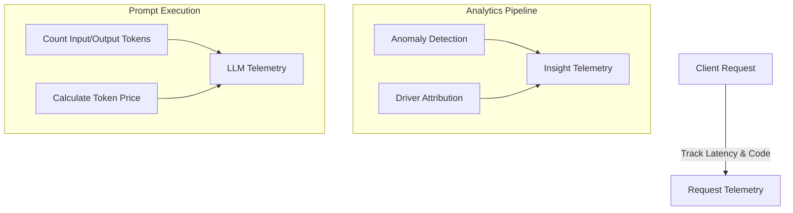

# Operational Telemetry & Costs — Specification

This document details the telemetry metrics collected by the engine to track performance, token usage, and LLM expenses.

---

## 1. Telemetry Domains

Telemetry logging tracks three separate dimensions: Request Performance, Insight Generation Pipeline, and LLM Execution Costs.

---

## 2. Request Telemetry Schema

Logs raw API transactions.
*   `request_id` (UUID): Unique string tracing the client request.
*   `timestamp` (TIMESTAMP): Executed datetime in UTC.
*   `user_id` (VARCHAR): Authenticated ID.
*   `persona` (VARCHAR): Selected user role.
*   `method` (VARCHAR): HTTP request verb (e.g., `GET`, `POST`).
*   `path` (VARCHAR): Route endpoint.
*   `status_code` (INTEGER): HTTP status response.
*   `latency_ms` (INTEGER): Round-trip duration in milliseconds.
*   `error_message` (TEXT): Stacktrace details if execution failed.

---

## 3. Insight Telemetry Schema

Tracks performance details of the background detection pipeline.
*   `insight_id` (UUID): Primary key.
*   `kpi_id` (VARCHAR): Checked metric.
*   `period` (VARCHAR): Target time segment.
*   `anomaly_id` (UUID): Linked anomaly.
*   `detection_latency_ms` (INTEGER): Miliseconds to run forecast and anomaly checks.
*   `explanation_latency_ms` (INTEGER): Miliseconds to execute SQL contribution algorithms.
*   `narrative_latency_ms` (INTEGER): Miliseconds taken by the LLM client call.
*   `materiality_score` (NUMERIC): Calculated index.
*   `confidence_score` (NUMERIC): Quality-weighted confidence index.
*   `data_quality_score` (NUMERIC): Calculated DQS index.

---

## 4. LLM Telemetry Schema & Cost Formulas

Monitors LLM API efficiency, costs, and token volumes.
*   `llm_call_id` (UUID): Primary key.
*   `request_id` (UUID): Tracing key link.
*   `model_name` (VARCHAR): AI model (e.g., `gpt-4o`, `claude-3-5-sonnet`).
*   `provider` (VARCHAR): e.g., `openai`, `anthropic`, `gemini`.
*   `prompt_type` (VARCHAR): Persona prompt key.
*   `input_tokens` (INTEGER): Number of context tokens.
*   `output_tokens` (INTEGER): Number of response tokens.
*   `latency_ms` (INTEGER): API response delay.
*   `estimated_cost_usd` (NUMERIC): Price computed for the call.
*   `cache_hit` (BOOLEAN): Flag indicating if prompt cache was hit.
*   `validation_passed` (BOOLEAN): Status indicating if Pydantic parsing was successful.
*   `error_message` (TEXT): Error message if LLM returned an invalid structure.

### Cost Calculation Equation
The operational cost is computed deterministically using pricing constants matching the provider's active rates:
$$estimated\_cost\_usd = input\_tokens \times input\_price\_per\_token + output\_tokens \times output\_price\_per\_token$$
